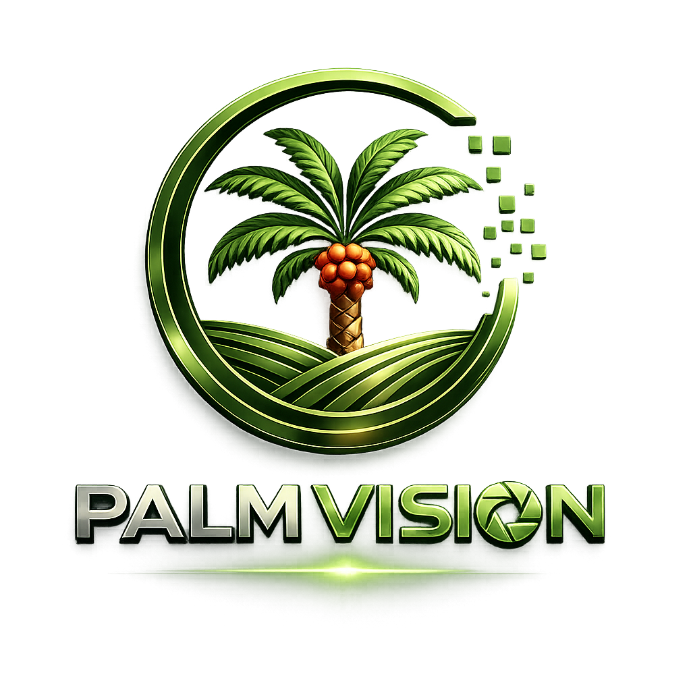
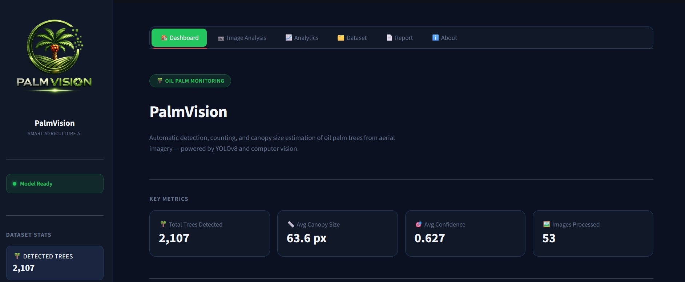
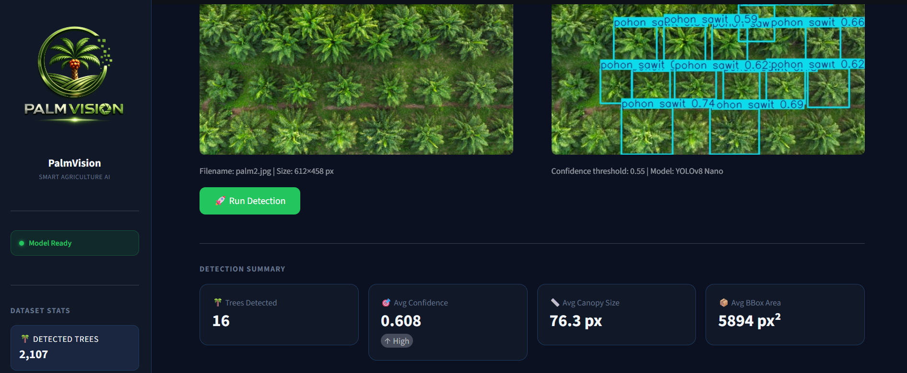
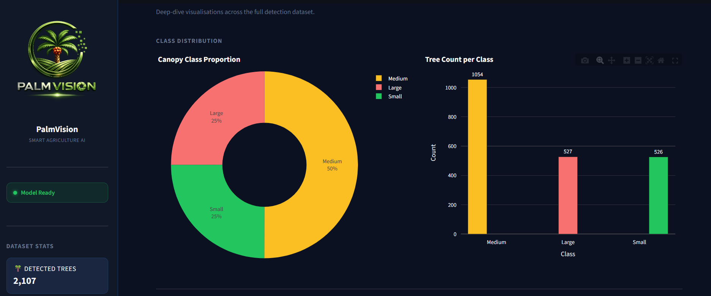
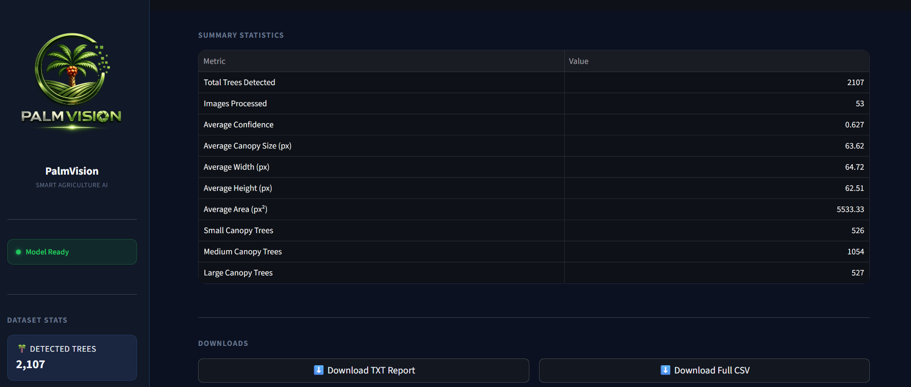

<div align="center">



# 🌴 PalmVision

### AI-powered Oil Palm Tree Detection & Canopy Analytics

An end-to-end Computer Vision application for automatic oil palm tree detection, tree counting, canopy size estimation, and interactive analytics from aerial imagery using **YOLOv8** and **Streamlit**.


</div>

---

# 📌 Overview

PalmVision is an Artificial Intelligence application designed to automate oil palm plantation monitoring using aerial imagery.

The system utilizes **YOLOv8** to detect oil palm trees and performs additional canopy analysis through post-processing techniques. Detection results are visualized in an interactive Streamlit dashboard that provides statistical summaries, AI-generated insights, and downloadable reports.

This project demonstrates the integration of **Deep Learning**, **Computer Vision**, **Data Analytics**, and **Web-based Visualization** into a single application.

---

# ✨ Features

✅ Oil Palm Tree Detection

✅ Tree Counting

✅ Canopy Size Estimation

✅ Canopy Classification (Small / Medium / Large)

✅ AI-generated Insights

✅ Interactive Dashboard

✅ Statistical Visualization

✅ Automatic Report Generation

✅ CSV Export

✅ Image-based Inference

---

# 🖥️ Dashboard Preview

PalmVision provides an intuitive web-based dashboard for oil palm plantation monitoring. The application integrates object detection, canopy analysis, interactive visualization, and automated reporting into a single platform.

---

## 📊 Dashboard

The main dashboard presents key performance indicators (KPIs), canopy statistics, AI-generated insights, and interactive visualizations that provide a comprehensive overview of the analyzed plantation.

<p align="center">
  
</p>

---

## 📷 Image Analysis

Users can upload aerial images captured by drones or other imaging platforms to perform automatic oil palm tree detection. The system estimates canopy size, counts detected trees, and displays inference results together with detection statistics.

<p align="center">
  
</p>

---

## 📈 Analytics

The analytics page provides interactive visualizations generated using Plotly, including canopy distribution, confidence score analysis, bounding box statistics, and canopy size distribution to support data-driven plantation assessment.

<p align="center">
  
</p>

---

## 📄 Report

PalmVision automatically summarizes the detection results into a structured report. The report includes overall detection statistics, canopy analysis, confidence metrics, and downloadable CSV files for further analysis and documentation.

<p align="center">
  
</p>

---

# 🏗 System Architecture

```
                Drone / Aerial Image
                        │
                        ▼
                YOLOv8 Detection Model
                        │
                        ▼
        Bounding Box & Confidence Score
                        │
                        ▼
          Canopy Size Estimation Module
                        │
                        ▼
         Statistical & AI Insight Module
                        │
                        ▼
          Interactive Streamlit Dashboard
```

---

# 🧠 AI Pipeline

```
Image Input
      │
      ▼
YOLOv8 Detection
      │
      ▼
Bounding Box Extraction
      │
      ▼
Canopy Size Calculation
      │
      ▼
Tree Classification
      │
      ▼
Statistics Generation
      │
      ▼
Dashboard Visualization
```

---

# 📊 Model Performance

| Metric | Value |
|---------|------:|
| Model | YOLOv8 Nano |
| Images | 59 Validation Images |
| Total Trees | 2,107 |
| Average Confidence | 0.627 |
| Average Canopy Size | 63.62 px |
| Canopy Classes | Small, Medium, Large |

---

# 📂 Project Structure

```text
PalmVision/
│
├── app.py
├── train.py
├── detect.py
├── canopy_statistics.py
├── visualization.py
├── report_generator.py
│
├── assets/
│     PalmVision.png
│
├── models/
│     best.pt
│
├── data/
│     tree_analysis.csv
│     tree_analysis_final.csv
│
├── sample_images/
│
├── requirements.txt
├── README.md
├── LICENSE
└── .gitignore
```

---

# ⚙ Installation

Clone repository

```bash
git clone https://github.com/yourusername/PalmVision.git
```

Go to project

```bash
cd PalmVision
```

Install dependencies

```bash
pip install -r requirements.txt
```

---

# 🚀 Run Application

Launch Streamlit Dashboard

```bash
streamlit run app.py
```

---

# 📁 Dataset

This project uses the **Oil Palm Tree Detection Dataset** from **Roboflow Universe**.

Dataset Source:

https://universe.roboflow.com/universitas-lampung-oevdg/oil-palm-tree-gjjx1

Special thanks to **Universitas Lampung** for providing the annotated dataset.

---

# 🛠 Technologies

- Python
- YOLOv8
- Ultralytics
- OpenCV
- Streamlit
- Plotly
- Pandas
- NumPy
- Matplotlib

---

# 💻 Developer Hardware

CPU

- Intel Core i5 11th Generation

GPU

- NVIDIA RTX 3050 Laptop GPU (4 GB)

---

# 🚧 Future Improvements

- Real-time Video Detection
- Jetson Nano Deployment
- TensorRT Optimization
- GIS Integration
- Heatmap Visualization
- GPS Coordinate Mapping
- Plantation Density Estimation

---

# 👨‍💻 Author

**Alfatio Sultansyah**

Bachelor of Telecommunications Engineering

Telkom University

Indonesia

---

# 📜 License

This project is released under the MIT License.

---

<div align="center">

⭐ If you found this project useful, please consider giving it a star.

</div>